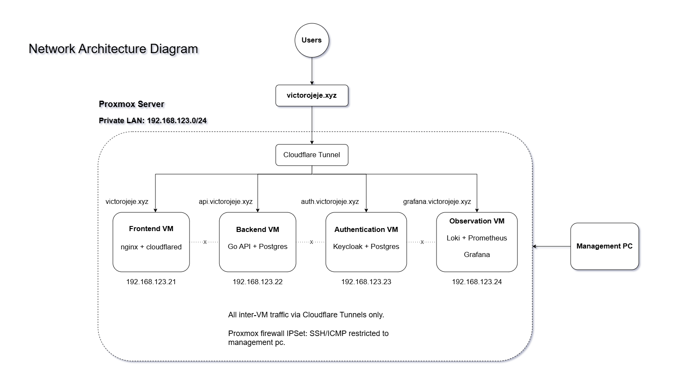
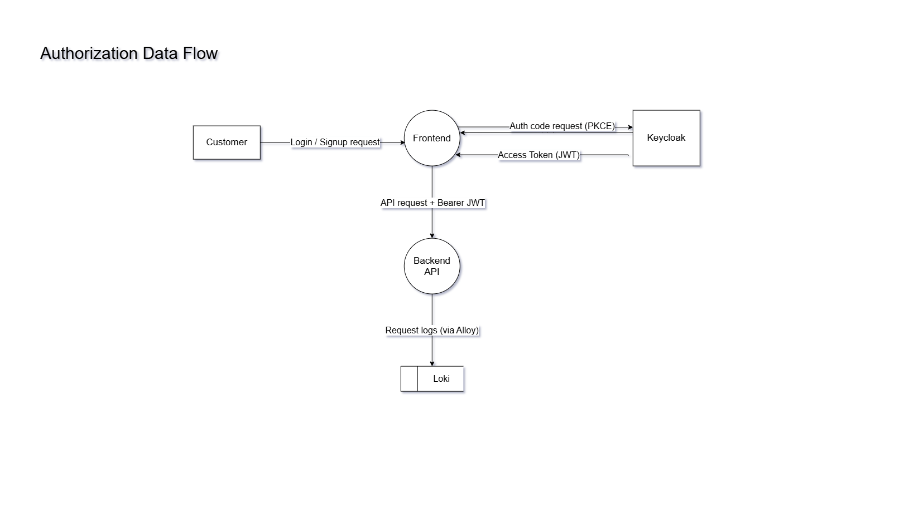
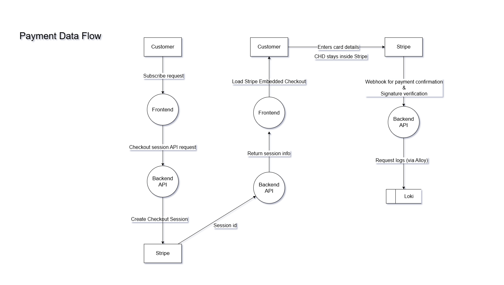
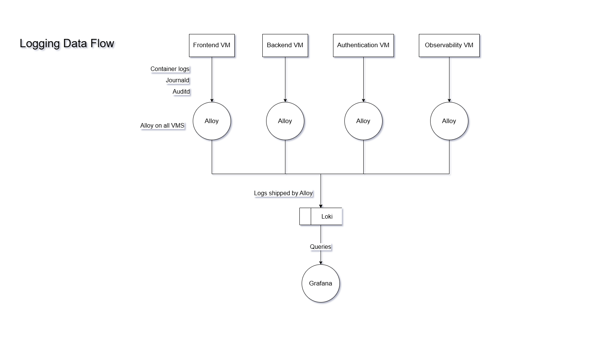

# WorkUp: On-Prem PCI DSS SAQ A-EP Payment Infrastructure

---

**Stack:** Proxmox · Terraform (`bpg/proxmox`) · Ansible · Docker Compose · Go 1.25 · Gin · Keycloak 26 · Stripe Embedded Checkout · Grafana · Loki · Prometheus · Grafana Alloy · Cloudflare Tunnels · GitLab CI

---

## What This Project Is

WorkUp is a fictional B2B project-management SaaS: $49/month per workspace, 100% e-commerce, ~150,000 transactions/year (PCI Level 3 merchant). The infrastructure is real. It runs on self-hosted Proxmox with four isolated Ubuntu 22.04 VMs, each serving a distinct segment of the stack.

The goal was not to build infrastructure and then ask "is it compliant?" The architecture was designed specifically to qualify for SAQ A-EP, then each technical control was implemented and documented against the corresponding PCI DSS v4.0.1 requirement. The output includes:

- A completed **SAQ A-EP** (`docs/PCI-DSS-v4-0-1-SAQ-A-EP-V1.pdf`)
- A signed **Attestation of Compliance** (`docs/PCI-DSS-v4-0-1-AOC-for-SAQ-A-EP-V1.pdf`)
- Supporting evidence: network diagram, data-flow diagrams, compliance notes, screenshots

---

## Why SAQ A-EP

PCI DSS defines several SAQ forms based on how a merchant handles cardholder data. SAQ A-EP applies when:

- The merchant's own servers host the payment page
- All card data entry happens inside a PCI-certified third party's environment (Stripe Embedded Checkout)
- The merchant's servers never receive, process, or store PANs, CVVs, or track data

This architecture satisfies all three conditions. The payment page (`billing.html`) loads from WorkUp's nginx. The actual card-entry form is a Stripe-controlled iframe served from `js.stripe.com`. The Go backend never receives card data; it receives only a Stripe session token and, post-payment, a webhook event.

The practical consequence: Requirements 3 (stored card data), 4 (card data in transit), and 9 (physical access to card data) are Not Applicable; there is nothing to protect. Requirements 1, 2, 5, 6, 7, 8, 10, and 11 still apply to the systems hosting the payment page and supporting infrastructure.

---

## Architecture

### Network Topology

> PCI DSS Req 1.2.3: current and accurate network diagram(s)



**Segments:**

| VM | IP | Services | Cloudflare hostname |
|----|----|----------|---------------------|
| Frontend | 192.168.123.21 | nginx (static assets) | victorojeje.xyz |
| Auth | 192.168.123.22 | Keycloak 26, Postgres 18 | auth.victorojeje.xyz |
| Backend | 192.168.123.23 | Go/Gin API, Postgres 18 | api.victorojeje.xyz |
| Observability | 192.168.123.24 | Grafana, Prometheus, Loki, Alloy | grafana / metrics / logs |

No VM communicates with another over the internal LAN. Inter-segment calls go through their respective public tunnel URLs. This satisfies PCI DSS Req 1 network segmentation without configuring any east-west firewall rules; the default-DROP policy on each VM is fully correct as-is.

---

### Data Flow Diagrams

> PCI DSS Req 1.2.4: current and accurate data flow diagram(s) that identify all cardholder data flows across systems and networks

**Authorization Flow:** Cloudflare Access → Keycloak OIDC → JWT validation on the Go API



**Payment Flow:** Authenticated user → Go API creates Stripe Checkout Session → Stripe iframe handles card entry → Stripe webhook confirms payment



**Logging and Observability Flow:** Grafana Alloy on each VM ships container logs, systemd journal, auditd output, and AIDE reports to centralized Loki; Prometheus scrapes metrics from Keycloak and the Go API



---

## What Was Built

### 1. Infrastructure as Code (Proxmox, Terraform, Ansible)

**Template creation (`infra/template.sh`):**  
A shell script that downloads the Ubuntu 22.04 Jammy cloud image, uploads it to Proxmox, boots a VM, installs Docker and the QEMU guest agent, then converts it to a reusable template. All four production VMs are full clones of this template. The script handles the `apt-daily.timer` race condition that causes `apt install` to fail on first boot of cloud images by masking the timer before touching apt.

**VM provisioning (`infra/terraform/`, provider: `bpg/proxmox` v0.112):**  
Four VMs defined as Terraform resources. Each gets a static IP, 10 GB disk, and memory sized to its workload (768 MB for nginx, 1536 MB for Keycloak, 1024 MB for Go, 1536 MB for the full observability stack). All have `firewall = true` on the network device, which is the flag that actually attaches the Proxmox NIC-level firewall policy. Without it, firewall rules defined in Terraform exist on paper but never enforce.

**Proxmox firewall (`infra/terraform/firewall.tf`):**  
Three-level firewall managed as code: Datacenter → Node → per-VM. Default input policy is DROP at all three levels. An IPSet (`management`) defines the management machine's IP. SSH (22) and ICMP are allowed from that IPSet only. Proxmox GUI (8006) is allowed at the cluster level for the host itself. Cluster-level security groups are referenced on each VM so the rules are defined once and reused.

**Configuration management (`infra/ansible/`):**  
Four playbooks, one per segment. Each playbook runs the same sequence: `host_firewall.yml` → `os_hardening.yml` → `auditd.yml` → `aide.yml` → application deploy. Application deploy uses Git sparse-checkout (each VM pulls only its own app directory) and Jinja2-templated `.env` files rendered from Ansible Vault-encrypted secrets. Handlers restart SSH and reload auditd rules only when the relevant config actually changes.

---

### 2. Network Security Controls (PCI Req 1)

Two independent firewall layers on every VM:

**Layer 1: Proxmox hypervisor NIC firewall (Terraform):**  
Operates at the virtual NIC level, below the guest OS. No application ports are opened. Only SSH and ICMP from the management network are permitted. Input policy is DROP; everything else is silently discarded.

**Layer 2: Guest OS ufw (Ansible):**  
`infra/ansible/playbooks/tasks/host_firewall.yml` resets ufw to defaults, sets default-deny incoming, and allows SSH only from the management CIDR. Runs on all four VMs. Independent of the Proxmox layer; if one is misconfigured, the other still holds.

**Why no container ports are published:**  
Docker bypasses ufw by writing directly to `iptables PREROUTING`. Any `ports:` mapping in a Compose file exposes that port to the entire LAN regardless of ufw's default-deny. The backend and auth compose files have no `ports:` blocks on application services. `cloudflared` reaches the API container via Docker's internal DNS (`http://api:8081`) without the port being published. The Keycloak compose binds to `127.0.0.1:8080` on the host for local bootstrap access only.

---

### 3. Identity, Access, and MFA (PCI Req 7 & 8)

**Keycloak 26 (`app/auth/`):**  
Self-hosted, running behind its own Cloudflare Tunnel. Configured entirely through a bootstrap script (`app/auth/bootstrap.sh`) that calls the Keycloak Admin REST API. No manual GUI steps required after deploy. The Ansible playbook waits for Keycloak's health endpoint before running the bootstrap.

**Realm settings applied by bootstrap:**

| Control | Value | PCI Req |
|---------|-------|---------|
| Password policy | 12-char minimum, upper + lower + digit + special, not username, 5-password history | 8.3.6 |
| Email verification | Required before account is usable | 8.3 |
| Brute-force protection | Lock after 5 failures, up to 30-min wait | 8.3.4 |
| Session idle timeout | 900 seconds | 8.2 |
| Session max lifetime | 28,800 seconds (8 hours) | 8.2 |
| Access token lifespan | 300 seconds | 8.2 |
| TOTP (CONFIGURE_TOTP) | Set as default required action via API | 8.4 |

**Clients:**  
Three OIDC clients created by the bootstrap: `workup-frontend` (public, PKCE S256, standard flow only), `cloudflare-access` (confidential, used as Cloudflare Zero Trust IdP), and `grafana` (confidential, Grafana SSO). Direct access grants are disabled on all three.

**RBAC model:**  
One realm role, `admin`, created in the `workup` realm. It is only meaningful where a downstream system reads it from the JWT. Currently: Grafana reads it via `role_attribute_path` and denies login to any user without it (`role_attribute_strict = true`). Customer self-registered accounts receive no realm role by default. Access to non-Keycloak systems (Stripe dashboard, GitLab, Proxmox, SSH) is controlled by those systems' own mechanisms and is not claimed as Keycloak-enforced.

**MFA:**  
TOTP configured as a required action on the realm, enforced on users with admin access. Cloudflare Access also offers OTP as an emergency backup login method.

**SMTP:**  
Resend (API key auth, `smtp.resend.com:465`, SSL) configured in the bootstrap for email verification and password reset. No manual Keycloak Admin Console steps after realm creation.

---

### 4. Payment Flow (PCI Req 3, 4, 6)

**Why card data never reaches WorkUp:**  
The frontend calls `POST /billing/create-checkout-session` (authenticated with a Keycloak JWT). The backend creates a Stripe Checkout Session and returns a `clientSecret`. The frontend calls `stripe.initEmbeddedCheckout({ clientSecret })` and mounts the checkout UI. The card entry form is rendered from `js.stripe.com` inside an iframe. PAN, CVV, and expiry date are submitted directly to Stripe's servers.

**Database schema confirms the scope:**  
`app/backend/db/schema.sql` has two tables: `workspaces` (keycloak_sub, name) and `subscriptions` (stripe_customer_id, stripe_subscription_id, status). No PAN-adjacent fields exist anywhere, not even last4. This was confirmed by code review, not assumed from the integration model.

**JWT validation in the Go API (`app/backend/internal/auth/auth.go`):**  
Uses `github.com/MicahParks/keyfunc/v3` to fetch and cache the JWKS from Keycloak's public endpoint. Every request to protected routes is validated with RS256, issuer check, and audience check. Rejection events are logged and recorded as Prometheus metrics.

**Stripe webhook security:**  
The webhook endpoint at `POST /billing/webhook` verifies the `Stripe-Signature` header against the webhook secret before processing any event. A Cloudflare Custom Rule additionally blocks any POST to `/billing/webhook` that arrives without the `stripe-signature` header, stopping unsigned payloads at the edge before they reach the backend.

**Stripe secret key:**  
Rotated mid-project from a full Standard key to a Restricted key scoped only to the operations the backend performs (create checkout sessions, receive webhook events). Old Standard key revoked after verification.

**Payment page script inventory (PCI Req 6.4.3):**  
Five scripts load on `billing.html`: four first-party files (`config.js`, `auth.js`, `nav.js`, `billing.js`) and `https://js.stripe.com/v3/`. Stripe.js does not support SRI; it updates dynamically for fraud detection. Compensating control: Stripe's PCI Level 1 status and its AOC cover the SDK's security. Full inventory with justifications is in `docs/evidence/payment-page-script-inventory.md`.

---

### 5. Logging, Monitoring, and Audit (PCI Req 10 & 11)

**Log collection architecture:**  
Grafana Alloy runs on all four VMs. On non-observability VMs, Alloy ships container logs (via Docker socket), systemd journal, auditd logs (`/var/log/audit/audit.log`), and AIDE check reports to the central Loki instance over HTTPS with Cloudflare Access service-token authentication. On the observability VM, Alloy writes locally (no tunnel hop).

**Sources collected per VM:**

| Source | Tool | What it captures |
|--------|------|-----------------|
| Container stdout/stderr | `loki.source.docker` | Application logs, error traces |
| Systemd journal | `loki.source.journal` | OS events, service starts/stops |
| auditd | `loki.source.file` on `/var/log/audit/audit.log` | Privileged commands, identity changes, audit config access |
| AIDE reports | `loki.source.file` on `/var/log/aide/*.log` | File integrity check results |

**auditd rules (`infra/ansible/playbooks/files/pci-audit.rules`):**  
Rules mapped directly to PCI DSS Req 10.2.1 sub-requirements: privileged command execution (`sudo`, `su`, `passwd`, user/group management), identity and authentication file changes (`/etc/passwd`, `/etc/shadow`, `/etc/sudoers*`, `sshd_config`), access to audit logs themselves, and the audit subsystem binaries.

**AIDE file integrity monitoring (PCI Req 11.5.2):**  
AIDE is installed on all four VMs via `infra/ansible/playbooks/tasks/aide.yml`. A database baseline is initialized after the known-good post-hardening state. A cron job runs `aide --check` daily at 03:17 and writes output to `/var/log/aide/aide-check.log`, which Alloy ships to Loki. After any legitimate change (deploy, config update), the database is rebuilt. Full scope and process documented in `docs/evidence/aide-fim.md`.

**Loki retention:**  
Set to 8760 hours (365 days) in `app/observability/loki-config.yaml`, satisfying PCI Req 10.5.1 (12-month minimum). Compactor runs every 10 minutes with retention enforcement enabled.

**Grafana access:**  
Protected by Cloudflare Access (Keycloak OIDC + OTP). Grafana uses Auth Proxy mode: Cloudflare Access forwards the authenticated user's email in the `Cf-Access-Authenticated-User-Email` header; Grafana trusts it and signs the user in without a second login prompt.

**Metrics:**  
Prometheus scrapes Keycloak (`/metrics` on port 9000), the Go API (`/metrics` on port 8081), and Prometheus itself. Alloy handles the scrape and ships metrics via `prometheus.remote_write` to the central Prometheus. The Go API exposes request counts, latency histograms, and auth rejection counters.

---

### 6. CI/CD and Security Scanning (PCI Req 6.2, 6.3)

**GitHub → GitLab mirror (`.github/workflows/mirror-to-gitlab.yml`):**  
GitHub is the code source of truth. On every push, a GitHub Actions workflow SSHes into GitLab using a deploy key and force-pushes the branch, excluding `.github/` so GitHub-specific config doesn't land in GitLab. GitLab runs the full CI pipeline on the mirrored code.

**GitLab CI pipeline (`.gitlab-ci.yml`):**

| Stage | Job | Tool | What it checks |
|-------|-----|------|----------------|
| test | `semgrep-sast` | Semgrep (GitLab SAST template) | Go source for known vulnerability patterns |
| test | `secret_detection` | GitLab Secret Detection | Committed credentials, tokens, API keys |
| test | `govulncheck` | `golang.org/x/vuln/cmd/govulncheck` | Go dependencies against the Go vulnerability database |
| build | `build-backend` | Docker-in-Docker | Builds the Go image, tags with commit SHA + `latest`, pushes to GitLab Container Registry |
| scan | `trivy-container` | Aqua Trivy | Scans the built image for HIGH and CRITICAL CVEs |

The backend image is built by GitLab CI and stored in the GitLab Container Registry. The Ansible playbook pulls `backend:latest` from the registry using a deploy token scoped to `read_registry` only.

**Multi-stage Dockerfile (`app/backend/Dockerfile`):**  
Builder stage: `golang:1.27-alpine`, `CGO_ENABLED=0 GOOS=linux`, `-ldflags="-s -w"` (strips debug symbols, shrinks binary). Final stage: `alpine:3.20`, custom non-root user (`workup:workup`, UID/GID 1000). The resulting image has no Go toolchain, no shell utilities beyond what alpine ships, and runs as a non-root user.

---

## PCI DSS v4.0.1 Controls Reference

| Requirement | Control implemented | Evidence |
|-------------|---------------------|----------|
| **1.2: Network security controls** | Proxmox NIC-level firewall (default DROP, management-only allow) + ufw on each guest | `infra/terraform/firewall.tf`, `tasks/host_firewall.yml` |
| **1.3: Restrict inbound/outbound** | No inter-VM LAN paths; cloudflared only ingress; no `ports:` on app containers | `app/*/docker-compose.yml` |
| **2.2.1: Secure config standard** | OS hardening Ansible tasks: sshd, sysctl (ASLR, syncookies, rp_filter), core dumps disabled | `tasks/os_hardening.yml` |
| **2.2.2: Default account control** | `ubuntu` sudo scoped to `docker`, `systemctl`, `ufw`; removes Proxmox default `NOPASSWD: ALL` | `tasks/os_hardening.yml` |
| **2.2.4: Unnecessary services** | `snapd` purged, `motd-news.timer` and `multipathd` disabled, `libpam-pwquality` dropped | `tasks/os_hardening.yml` |
| **3.3-3.7: Stored card data** | **N/A**: Stripe Embedded Checkout; DB schema has no PAN/SAD fields | `app/backend/db/schema.sql`, `docs/evidence/na-justifications.md` |
| **4.2.1: Cardholder data in transit** | **N/A**: no CHD transmitted by WorkUp. Public TLS via Cloudflare for all other traffic | `docs/evidence/na-justifications.md` |
| **5.1: Anti-malware** | **N/A (justified)**: headless container-only hosts; GitLab CI Trivy + govulncheck as relevant controls | `docs/evidence/na-justifications.md` |
| **6.2: Secure development** | GitLab CI SAST (Semgrep) + Secret Detection on every push | `.gitlab-ci.yml` |
| **6.3: Vulnerability identification** | `govulncheck` against Go vuln DB + Trivy container scan on every main build | `.gitlab-ci.yml` |
| **6.4.3: Payment page scripts** | Inventory of all 5 scripts on billing.html, justification per script, SRI limitation documented | `docs/evidence/payment-page-script-inventory.md` |
| **7.2: Access by need to know** | Keycloak `admin` realm role + Grafana strict-mode role gating; Stripe Restricted key | `app/auth/bootstrap.sh`, `app/observability/docker-compose.yml` |
| **8.3.6: Password complexity** | `length(12) and upperCase(1) and lowerCase(1) and digits(1) and specialChars(1) and notUsername and passwordHistory(5)` | `app/auth/bootstrap.sh` |
| **8.3.4: Lockout policy** | Brute-force protection: failureFactor 5, max wait 1800s, temporary lockout | `app/auth/bootstrap.sh` |
| **8.4: MFA** | Keycloak TOTP set as default required action; Cloudflare Access OTP as backup | `app/auth/bootstrap.sh`, `docs/evidence/keycloak-auth-controls.md` |
| **9: Physical access** | **N/A**: no CHD exists; no physical media with account data | `docs/evidence/na-justifications.md` |
| **10.2.1: Audit events** | auditd rules covering privileged commands, identity changes, auth file access, audit subsystem | `infra/ansible/playbooks/files/pci-audit.rules` |
| **10.3: Log protection** | Logs shipped centrally to Loki; Grafana access gated behind Cloudflare Access + Keycloak | `app/*/alloy-config.river` |
| **10.5.1: Log retention** | Loki `retention_period: 8760h` (365 days) with compactor enforcement | `app/observability/loki-config.yaml` |
| **10.6: Time synchronization** | `chrony` installed and enabled on all VMs; `systemd-timesyncd` disabled to avoid conflict | `tasks/os_hardening.yml` |
| **11.5.2: Change detection (FIM)** | AIDE on all four VMs, daily cron check, reports shipped to Loki | `tasks/aide.yml`, `docs/evidence/aide-fim.md` |
| **11.6.1: Payment page tamper detection** | Weekly review procedure against script inventory; SHA-256 hash baseline | `docs/evidence/payment-page-script-inventory.md` |

---

## Repository Structure

```
on-prem-workup-pci-dss/
│
├── infra/
│   ├── template.sh                          # Proxmox base VM template (cloud-image → Docker ready)
│   ├── terraform/
│   │   ├── versions.tf                      # bpg/proxmox ~0.112.0, Terraform ~1.16.1
│   │   ├── provider.tf                      # Proxmox provider + SSH config
│   │   ├── clones.tf                        # 4 VM definitions (full clone from template)
│   │   ├── firewall.tf                      # Datacenter + Node + VM firewall (all three levels)
│   │   ├── variables.tf / terraform.tfvars
│   │   └── backend.tf                       # local state
│   └── ansible/
│       ├── ansible.cfg
│       ├── inventory/hosts.yml              # 4 hosts with static IPs
│       ├── vars/
│       │   ├── management.yml               # management_network CIDR
│       │   └── secrets.yml                  # Ansible Vault (gitignored)
│       └── playbooks/
│           ├── frontend.yml / auth.yml / backend.yml / observability.yml
│           ├── tasks/
│           │   ├── host_firewall.yml        # ufw setup
│           │   ├── os_hardening.yml         # sshd, sysctl, sudo scope, services
│           │   ├── auditd.yml               # auditd install + rule deploy
│           │   └── aide.yml                 # AIDE install + baseline + cron
│           ├── files/
│           │   └── pci-audit.rules          # auditd rules mapped to PCI 10.2.1
│           └── templates/
│               └── *.env.j2                 # environment templates per segment
│
├── app/
│   ├── frontend/
│   │   ├── static_files/                    # index.html, login.html, billing.html, JS, CSS
│   │   ├── nginx/conf.d/http.conf           # nginx on port 80 (TLS at Cloudflare)
│   │   ├── alloy-config.river               # Alloy log/metric collection
│   │   └── docker-compose.yml
│   ├── auth/
│   │   ├── bootstrap.sh                     # Keycloak realm/clients/OTP/RBAC/SMTP via REST API
│   │   ├── alloy-config.river
│   │   └── docker-compose.yml               # Keycloak 26 + Postgres 18 + cloudflared + Alloy
│   ├── backend/
│   │   ├── cmd/server/main.go               # Gin server, CORS, metrics, auth middleware
│   │   ├── internal/
│   │   │   ├── auth/auth.go                 # JWKS-based JWT validation (RS256, iss, aud)
│   │   │   ├── billing/billing.go           # Stripe checkout session + webhook handler
│   │   │   ├── db/db.go                     # pgx/v5 connection pool
│   │   │   └── metrics/metrics.go           # Prometheus counters + histograms
│   │   ├── db/schema.sql                    # workspaces + subscriptions (no PAN fields)
│   │   ├── Dockerfile                       # multi-stage, non-root user, CGO_ENABLED=0
│   │   ├── alloy-config.river
│   │   └── docker-compose.yml               # api (no ports:) + Postgres + cloudflared + Alloy
│   └── observability/
│       ├── grafana/provisioning/            # pre-provisioned datasources + dashboard
│       ├── loki-config.yaml                 # 8760h retention + compactor
│       ├── prometheus.yml
│       ├── alloy-config.river               # local write (no CF_ACCESS)
│       └── docker-compose.yml               # Grafana + Prometheus + Loki + Alloy + cloudflared
│
├── docs/
│   ├── PCI-DSS-v4-0-1-SAQ-A-EP-V1.pdf      # Completed SAQ
│   ├── PCI-DSS-v4-0-1-AOC-for-SAQ-A-EP-V1.pdf  # Signed AOC
│   ├── diagrams/
│   │   ├── network-diagram.png              # PCI Req 1.2.3
│   │   ├── data-flow-authorization.png      # Req 1.2.4 (auth flow)
│   │   ├── data-flow-payment.png            # Req 1.2.4 (payment flow)
│   │   └── data-flow-logging.png            # Req 1.2.4 (log flow)
│   └── evidence/
│       ├── keycloak-auth-controls.md        # Req 7 & 8: Keycloak config + MFA
│       ├── aide-fim.md                      # Req 11.5.2: AIDE FIM scope and process
│       ├── payment-page-script-inventory.md # Req 6.4.3 & 11.6.1: script inventory
│       ├── na-justifications.md             # Req 3, 4, 5, 9: N/A writeups
│       └── screenshots/                     # Keycloak, Grafana, Cloudflare, Proxmox evidence
│
├── .github/workflows/mirror-to-gitlab.yml   # Auto-mirror to GitLab on push
└── .gitlab-ci.yml                           # SAST + secret detection + build + Trivy scan
```

---

## Key Design Decisions

**No inter-VM LAN traffic.** All inter-segment calls use public Cloudflare Tunnel URLs. The consequence is that the Proxmox default-DROP firewall is correct with zero application-level exceptions; no firewall rules need to be opened between VMs, ever. This is a cleaner compliance story than trying to scope which LAN ports are allowed.

**`firewall = true` is not automatic.** The Proxmox `bpg` provider requires `firewall = true` explicitly on the `network_device` block in the VM definition. Without it, firewall resources in `firewall.tf` have no effect; the rules exist in the API but are never evaluated for that NIC. This was a real misconfiguration caught mid-project (auth, backend, and observability VMs were missing the flag).

**Docker `ports:` bypasses ufw.** Docker writes `iptables PREROUTING` rules that are evaluated before the `INPUT` chain where ufw's rules sit. Publishing a container port with `ports: ["8080:8080"]` exposes it to the LAN regardless of ufw's default-deny. All application services in this project have no `ports:` block. `cloudflared` reaches them via Docker's internal service DNS.

**Keycloak bootstrapped via REST API, not exported realm JSON.** A realm JSON export can work but becomes a maintenance burden when individual settings need updating; you need to diff and re-import. The bootstrap script (`bootstrap.sh`) is idempotent: it checks whether each resource exists, creates it if not, and updates it if it does. The same `REALM_SETTINGS` block is used for both the initial create and subsequent updates, so the two paths are never out of sync.

**One `admin` realm role, not four.** An early design created four Keycloak roles (`admin`, `billing-ops`, `support`, `developer`). `billing-ops` maps to Stripe, `developer` maps to GitLab; neither system authenticates via Keycloak. Creating Keycloak roles for them produces dead configuration that passes audits on paper but is enforced by nothing. The correct model is to document each system's own access control separately and not claim Keycloak enforces what it doesn't.

**Grafana auth proxy over Keycloak OIDC.** The final setup uses Cloudflare Access Auth Proxy: Cloudflare authenticates users before they reach Grafana and passes the user's email in a trusted header. Grafana reads the header and signs users in without prompting for credentials again. The earlier Keycloak OIDC approach caused a double-login flow (Cloudflare Access, then Grafana's own OIDC redirect). Auth Proxy eliminates this while keeping the access gating at the edge.

**Loki retention at 365 days, not the minimum 12 months exactly.** `8760h` is 365 days, which is one year. PCI Req 10.5.1 requires 12 months. Any rounding that lands below 365 is a compliance gap.

**Stripe Restricted key, not Standard.** Standard keys have access to the full Stripe API. The backend only needs to create checkout sessions and receive webhook events. A Restricted key is scoped to exactly those operations. The Standard key in use at the start of the project was rotated mid-project when this gap was identified.

---

## Compliance Documents

All compliance documents are in the `docs/` directory:

| Document | Description |
|----------|-------------|
| `PCI-DSS-v4-0-1-SAQ-A-EP-V1.pdf` | Completed Self-Assessment Questionnaire |
| `PCI-DSS-v4-0-1-AOC-for-SAQ-A-EP-V1.pdf` | Attestation of Compliance |
| `docs/evidence/keycloak-auth-controls.md` | Keycloak configuration evidence (Req 7 & 8) |
| `docs/evidence/aide-fim.md` | AIDE file integrity monitoring evidence (Req 11.5.2) |
| `docs/evidence/payment-page-script-inventory.md` | Payment page script inventory (Req 6.4.3 & 11.6.1) |
| `docs/evidence/na-justifications.md` | N/A justifications for Req 3, 4, 5, 9 |
| `docs/diagrams/` | Network + 3 data-flow diagrams (Req 1.2.3 & 1.2.4) |

---

## Running the Project

The infrastructure runs on a local Proxmox instance. To reproduce:

```bash
# 1. Create the base VM template (run once)
chmod +x infra/template.sh
./infra/template.sh

# 2. Provision the 4 VMs
cd infra/terraform
cp terraform.tfvars.example terraform.tfvars   # fill in Proxmox endpoint + API token
terraform init
terraform apply

# 3. Configure VMs and deploy applications
cd infra/ansible
ansible-playbook playbooks/frontend.yml
ansible-playbook playbooks/auth.yml
ansible-playbook playbooks/backend.yml
ansible-playbook playbooks/observability.yml
```

Secrets (`vars/secrets.yml`) are Ansible Vault-encrypted and not committed. Create your own with the variables referenced in `playbooks/templates/*.env.j2`.

The backend Docker image is built by GitLab CI on push to `main` and stored in the GitLab Container Registry. The Backend VM pulls it at deploy time using a `read_registry` deploy token.

## Contact

**Victor Ogechukwu Ojeje**
Cloud & Infrastructure Engineer

- LinkedIn: https://www.linkedin.com/in/victorojeje/
- Blog: https://dev.to/escanut
- Email: ojejevictor@gmail.com 